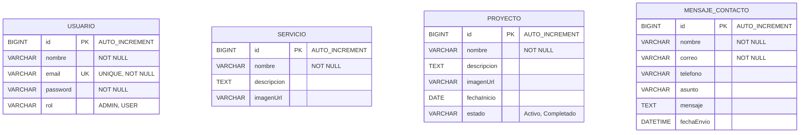

# DOCUMENTACIÓN TÉCNICA DEL PROYECTO
## CARPENTRY Y ACABADOS SYC

**Autor:** Sistema de Gestión Web
**Fecha:** Noviembre 2025
**Versión:** 1.0
**Tecnología:** Spring Boot 3.5.3 + MySQL 8 + Thymeleaf

---

## TABLA DE CONTENIDO

1. [Introducción](#introducción)
2. [Objetivos del Proyecto](#objetivos-del-proyecto)
3. [Alcance](#alcance)
4. [Arquitectura del Sistema](#arquitectura-del-sistema)
5. [Diagrama de Entidad-Relación](#diagrama-de-entidad-relación)
6. [Diagrama de Clases](#diagrama-de-clases)
7. [Diagrama de Casos de Uso](#diagrama-de-casos-de-uso)
8. [Descripción de Entidades](#descripción-de-entidades)
9. [Descripción de Controladores](#descripción-de-controladores)
10. [Tecnologías Utilizadas](#tecnologías-utilizadas)
11. [Estructura del Proyecto](#estructura-del-proyecto)
12. [Funcionalidades Principales](#funcionalidades-principales)
13. [Manual de Instalación](#manual-de-instalación)
14. [Manual de Usuario](#manual-de-usuario)
15. [Conclusiones y Recomendaciones](#conclusiones-y-recomendaciones)

---

## 1. INTRODUCCIÓN

### 1.1 Descripción General

El proyecto **Carpentry y Acabados SYC** es una aplicación web fullstack desarrollada con Spring Boot que permite gestionar los servicios, proyectos y contactos de una empresa dedicada a la carpintería y acabados. El sistema cuenta con un sitio web público para mostrar información de la empresa y un panel administrativo para gestionar el contenido.

### 1.2 Propósito del Sistema

Proporcionar una plataforma integral que permita:
- Mostrar los servicios ofrecidos por la empresa
- Exhibir el portafolio de proyectos realizados
- Recibir y gestionar mensajes de contacto
- Administrar usuarios del sistema
- Gestionar el contenido del sitio web de manera dinámica

### 1.3 Contexto del Proyecto

Este proyecto fue desarrollado como proyecto final de [nombre del curso/carrera], aplicando conceptos de:
- Desarrollo web fullstack
- Arquitectura MVC (Model-View-Controller)
- Persistencia de datos con JPA/Hibernate
- Seguridad con Spring Security
- Diseño de interfaces con Bootstrap

---

## 2. OBJETIVOS DEL PROYECTO

### 2.1 Objetivo General

Desarrollar un sistema web integral para la gestión y promoción de servicios de carpintería, que permita tanto la exhibición pública de información como la administración interna de contenidos y clientes.

### 2.2 Objetivos Específicos

1. **Implementar un sitio web público** que muestre información de la empresa, servicios y proyectos realizados
2. **Desarrollar un panel administrativo** con funcionalidad CRUD para gestionar:
   - Servicios ofrecidos
   - Proyectos realizados
   - Usuarios del sistema
   - Mensajes de contacto
3. **Integrar un sistema de autenticación** para proteger áreas administrativas
4. **Implementar una base de datos relacional** con MySQL para persistencia de información
5. **Diseñar interfaces responsivas** utilizando Bootstrap 5

---

## 3. ALCANCE

### 3.1 Módulos Incluidos

#### Módulo Público (Sin autenticación)
- ✅ Página de inicio
- ✅ Sección "Nosotros"
- ✅ Catálogo de servicios
- ✅ Formulario de contacto

#### Módulo de Autenticación
- ✅ Registro de usuarios
- ✅ Login de usuarios
- ✅ Recuperación de contraseña

#### Módulo Administrativo
- ✅ Dashboard con estadísticas
- ✅ CRUD de servicios
- ✅ CRUD de proyectos
- ✅ CRUD de usuarios
- ✅ Gestión de mensajes de contacto

### 3.2 Limitaciones

- El sistema actualmente no implementa sistema de pagos
- No incluye catálogo de productos con inventario
- Las contraseñas no están encriptadas (pendiente de implementar BCrypt)
- La configuración de seguridad está en modo desarrollo (permite todas las peticiones)

---

## 4. ARQUITECTURA DEL SISTEMA

### 4.1 Patrón Arquitectónico: MVC (Model-View-Controller)

El proyecto sigue el patrón arquitectónico **MVC (Model-View-Controller)** implementado por Spring Boot:

```
┌─────────────────────────────────────────────────────────────┐
│                    CAPA DE PRESENTACIÓN                     │
│                   (View - Thymeleaf)                        │
│  ┌──────────────┐  ┌──────────────┐  ┌──────────────┐     │
│  │  Páginas     │  │  Panel       │  │  Auth        │     │
│  │  Públicas    │  │  Admin       │  │  Views       │     │
│  └──────────────┘  └──────────────┘  └──────────────┘     │
└────────────────────────┬────────────────────────────────────┘
                         │ HTTP/REST
┌────────────────────────▼────────────────────────────────────┐
│                    CAPA DE CONTROL                          │
│                    (Controllers)                            │
│  ┌──────────────┐  ┌──────────────┐  ┌──────────────┐     │
│  │ Paginas      │  │ Admin        │  │ Auth         │     │
│  │ Controller   │  │ Controller   │  │ Controller   │     │
│  └──────────────┘  └──────────────┘  └──────────────┘     │
│  ┌──────────────┐  ┌──────────────┐                        │
│  │ Usuario      │  │ Contacto     │                        │
│  │ Controller   │  │ Controller   │                        │
│  └──────────────┘  └──────────────┘                        │
└────────────────────────┬────────────────────────────────────┘
                         │
┌────────────────────────▼────────────────────────────────────┐
│                    CAPA DE SERVICIOS                        │
│                    (Business Logic)                         │
│  ┌──────────────────────────────────────────┐              │
│  │       ServicioService                    │              │
│  │  - listarTodos()                         │              │
│  │  - guardar(Servicio)                     │              │
│  │  - buscarPorId(Long)                     │              │
│  │  - eliminar(Long)                        │              │
│  └──────────────────────────────────────────┘              │
└────────────────────────┬────────────────────────────────────┘
                         │
┌────────────────────────▼────────────────────────────────────┐
│                    CAPA DE PERSISTENCIA                     │
│                    (Repositories - JPA)                     │
│  ┌──────────────┐  ┌──────────────┐  ┌──────────────┐     │
│  │ Usuario      │  │ Servicio     │  │ Proyecto     │     │
│  │ Repository   │  │ Repository   │  │ Repository   │     │
│  └──────────────┘  └──────────────┘  └──────────────┘     │
│  ┌──────────────┐                                           │
│  │ Contacto     │                                           │
│  │ Repository   │                                           │
│  └──────────────┘                                           │
└────────────────────────┬────────────────────────────────────┘
                         │ JDBC
┌────────────────────────▼────────────────────────────────────┐
│                    CAPA DE DATOS                            │
│                    (MySQL Database)                         │
│  ┌──────────────┐  ┌──────────────┐  ┌──────────────┐     │
│  │  usuarios    │  │  servicio    │  │  proyecto    │     │
│  │  (Tabla)     │  │  (Tabla)     │  │  (Tabla)     │     │
│  └──────────────┘  └──────────────┘  └──────────────┘     │
│  ┌──────────────┐                                           │
│  │ mensaje_     │                                           │
│  │ contacto     │                                           │
│  └──────────────┘                                           │
└─────────────────────────────────────────────────────────────┘
```

### 4.2 Componentes Principales

| Componente | Tecnología | Descripción |
|------------|-----------|-------------|
| **Frontend** | Thymeleaf + Bootstrap 5 | Motor de plantillas del lado del servidor |
| **Backend** | Spring Boot 3.5.3 | Framework Java para aplicaciones web |
| **Persistencia** | Spring Data JPA + Hibernate | ORM para mapeo objeto-relacional |
| **Base de Datos** | MySQL 8 | Sistema gestor de base de datos |
| **Seguridad** | Spring Security 6 | Framework de autenticación y autorización |
| **Build Tool** | Maven | Gestión de dependencias y construcción |

---

## 5. DIAGRAMA DE ENTIDAD-RELACIÓN

### 5.1 Diagrama ER (Entity-Relationship)



### 5.2 Descripción de Relaciones

El modelo actual **NO tiene relaciones explícitas** entre entidades (sin claves foráneas). Cada entidad es independiente:

- **USUARIO**: Almacena los usuarios del sistema con sus roles
- **SERVICIO**: Catálogo de servicios ofrecidos por la empresa
- **PROYECTO**: Portafolio de proyectos realizados
- **MENSAJE_CONTACTO**: Mensajes recibidos del formulario de contacto

### 5.3 Diccionario de Datos

#### Tabla: USUARIO (usuarios)

| Campo | Tipo | Restricción | Descripción |
|-------|------|-------------|-------------|
| id | BIGINT | PK, AUTO_INCREMENT | Identificador único |
| nombre | VARCHAR(255) | NOT NULL | Nombre completo del usuario |
| email | VARCHAR(255) | UNIQUE, NOT NULL | Correo electrónico (usado para login) |
| password | VARCHAR(255) | NOT NULL | Contraseña (sin encriptar actualmente) |
| rol | VARCHAR(50) | NOT NULL | Rol del usuario (ADMIN o USER) |

#### Tabla: SERVICIO (servicio)

| Campo | Tipo | Restricción | Descripción |
|-------|------|-------------|-------------|
| id | BIGINT | PK, AUTO_INCREMENT | Identificador único |
| nombre | VARCHAR(255) | NOT NULL | Nombre del servicio |
| descripcion | TEXT | | Descripción detallada del servicio |
| imagenUrl | VARCHAR(500) | | URL de la imagen representativa |

#### Tabla: PROYECTO (proyecto)

| Campo | Tipo | Restricción | Descripción |
|-------|------|-------------|-------------|
| id | BIGINT | PK, AUTO_INCREMENT | Identificador único |
| nombre | VARCHAR(255) | NOT NULL | Nombre del proyecto |
| descripcion | TEXT | | Descripción del proyecto |
| imagenUrl | VARCHAR(500) | | URL de imagen del proyecto |
| fechaInicio | DATE | | Fecha de inicio del proyecto |
| estado | VARCHAR(50) | | Estado (Activo, Completado, En Proceso) |

#### Tabla: MENSAJE_CONTACTO (mensaje_contacto)

| Campo | Tipo | Restricción | Descripción |
|-------|------|-------------|-------------|
| id | BIGINT | PK, AUTO_INCREMENT | Identificador único |
| nombre | VARCHAR(255) | NOT NULL | Nombre del remitente |
| correo | VARCHAR(255) | NOT NULL | Email del remitente |
| telefono | VARCHAR(20) | | Teléfono de contacto |
| asunto | VARCHAR(255) | | Asunto del mensaje |
| mensaje | TEXT | | Contenido del mensaje |
| fechaEnvio | DATETIME | | Fecha y hora del envío |

---

## 6. DIAGRAMA DE CLASES

### 6.1 Diagrama UML Completo

```mermaid
classDiagram
    %% ========== CAPA DE MODELO (ENTIDADES) ==========
    class Usuario {
        -Long id
        -String nombre
        -String email
        -String password
        -String rol
        +Usuario()
        +getId() Long
        +setId(Long) void
        +getNombre() String
        +setNombre(String) void
        +getEmail() String
        +setEmail(String) void
        +getPassword() String
        +setPassword(String) void
        +getRol() String
        +setRol(String) void
    }

    class Servicio {
        -Long id
        -String nombre
        -String descripcion
        -String imagenUrl
        +Servicio()
        +getId() Long
        +setId(Long) void
        +getNombre() String
        +setNombre(String) void
        +getDescripcion() String
        +setDescripcion(String) void
        +getImagenUrl() String
        +setImagenUrl(String) void
    }

    class Proyecto {
        -Long id
        -String nombre
        -String descripcion
        -String imagenUrl
        -LocalDate fechaInicio
        -String estado
        +Proyecto()
        +getId() Long
        +setId(Long) void
        +getNombre() String
        +setNombre(String) void
        +getDescripcion() String
        +setDescripcion(String) void
        +getImagenUrl() String
        +setImagenUrl(String) void
        +getFechaInicio() LocalDate
        +setFechaInicio(LocalDate) void
        +getEstado() String
        +setEstado(String) void
    }

    class MensajeContacto {
        -Long id
        -String nombre
        -String correo
        -String telefono
        -String asunto
        -String mensaje
        -LocalDateTime fechaEnvio
        +MensajeContacto()
        +getId() Long
        +setId(Long) void
        +getNombre() String
        +setNombre(String) void
        +getCorreo() String
        +setCorreo(String) void
        +getTelefono() String
        +setTelefono(String) void
        +getAsunto() String
        +setAsunto(String) void
        +getMensaje() String
        +setMensaje(String) void
        +getFechaEnvio() LocalDateTime
        +setFechaEnvio(LocalDateTime) void
    }

    %% ========== CAPA DE REPOSITORIO ==========
    class UsuarioRepository {
        <<interface>>
        +findByEmail(String) Optional~Usuario~
        +findAll() List~Usuario~
        +save(Usuario) Usuario
        +deleteById(Long) void
    }

    class ServicioRepository {
        <<interface>>
        +findAll() List~Servicio~
        +save(Servicio) Servicio
        +findById(Long) Optional~Servicio~
        +deleteById(Long) void
    }

    class ProyectoRepository {
        <<interface>>
        +findAll() List~Proyecto~
        +save(Proyecto) Proyecto
        +findById(Long) Optional~Proyecto~
        +deleteById(Long) void
    }

    class ContactoRepository {
        <<interface>>
        +findAll() List~MensajeContacto~
        +save(MensajeContacto) MensajeContacto
        +deleteById(Long) void
    }

    %% ========== CAPA DE SERVICIO ==========
    class ServicioService {
        -ServicioRepository servicioRepository
        +ServicioService(ServicioRepository)
        +listarTodos() List~Servicio~
        +guardar(Servicio) Servicio
        +buscarPorId(Long) Servicio
        +eliminar(Long) void
    }

    %% ========== CAPA DE CONTROLADORES ==========
    class PaginasController {
        -ServicioRepository servicioRepository
        -ProyectoRepository proyectoRepository
        +PaginasController(ServicioRepository, ProyectoRepository)
        +inicio(Model) String
        +nosotros(Model) String
        +servicios(Model) String
        +contacto() String
    }

    class AdminController {
        -ServicioRepository servicioRepository
        -ProyectoRepository proyectoRepository
        -UsuarioRepository usuarioRepository
        -ContactoRepository contactoRepository
        +AdminController(...)
        +dashboard(Model) String
        +listarServicios(Model) String
        +guardarServicio(Servicio) String
        +eliminarServicio(Long) String
        +listarProyectos(Model) String
        +guardarProyecto(Proyecto) String
        +eliminarProyecto(Long) String
        +listarUsuarios(Model) String
        +guardarUsuario(Usuario) String
        +eliminarUsuario(Long) String
        +listarContactos(Model) String
        +eliminarContacto(Long) String
    }

    class UsuarioController {
        -UsuarioRepository usuarioRepository
        +UsuarioController(UsuarioRepository)
        +mostrarLogin() String
        +mostrarRegistro() String
        +registrarUsuario(Usuario, Model) String
    }

    class ContactoController {
        +recibirMensaje(MensajeContacto) String
    }

    class AuthController {
        +login() String
        +register() String
        +password() String
    }

    %% ========== CONFIGURACIÓN ==========
    class SecurityConfig {
        +filterChain(HttpSecurity) SecurityFilterChain
        +passwordEncoder() PasswordEncoder
    }

    class CarpentryApplication {
        +main(String[]) void
    }

    %% ========== RELACIONES ==========
    UsuarioRepository ..|> JpaRepository
    ServicioRepository ..|> JpaRepository
    ProyectoRepository ..|> JpaRepository
    ContactoRepository ..|> JpaRepository

    ServicioService --> ServicioRepository : usa

    PaginasController --> ServicioRepository : usa
    PaginasController --> ProyectoRepository : usa

    AdminController --> ServicioRepository : usa
    AdminController --> ProyectoRepository : usa
    AdminController --> UsuarioRepository : usa
    AdminController --> ContactoRepository : usa

    UsuarioController --> UsuarioRepository : usa

    UsuarioRepository ..> Usuario : gestiona
    ServicioRepository ..> Servicio : gestiona
    ProyectoRepository ..> Proyecto : gestiona
    ContactoRepository ..> MensajeContacto : gestiona

    ServicioService ..> Servicio : gestiona

    %% Interface JpaRepository
    class JpaRepository {
        <<interface>>
        +findAll() List~T~
        +findById(ID) Optional~T~
        +save(T) T
        +deleteById(ID) void
    }
```



### 6.2 Descripción de Clases por Capas

#### 6.2.1 Capa de Modelo (Entidades JPA)

**Usuario** (`model/Usuario.java`)
- **Responsabilidad**: Representa un usuario del sistema
- **Anotaciones**: `@Entity`, `@Table(name="usuarios")`
- **Atributos clave**: `email` (único), `rol` (ADMIN/USER)

**Servicio** (`model/Servicio.java`)
- **Responsabilidad**: Representa un servicio ofrecido
- **Anotaciones**: `@Entity`
- **Uso**: Catálogo de servicios en sitio público y admin

**Proyecto** (`model/Proyecto.java`)
- **Responsabilidad**: Representa proyectos realizados
- **Anotaciones**: `@Entity`
- **Atributos temporales**: `fechaInicio`, `estado`

**MensajeContacto** (`model/MensajeContacto.java`)
- **Responsabilidad**: Almacena mensajes de contacto
- **Anotaciones**: `@Entity`
- **Timestamp**: `fechaEnvio` (generado automáticamente)

#### 6.2.2 Capa de Repositorio (Spring Data JPA)

Todos los repositorios extienden `JpaRepository<T, Long>` y heredan métodos CRUD:
- `findAll()`: Listar todos los registros
- `findById(Long)`: Buscar por ID
- `save(T)`: Guardar o actualizar
- `deleteById(Long)`: Eliminar por ID

**UsuarioRepository** agrega:
- `Optional<Usuario> findByEmail(String email)`: Búsqueda por email

#### 6.2.3 Capa de Servicio (Lógica de Negocio)

**ServicioService** (`service/ServicioService.java`)
- **Responsabilidad**: Encapsula lógica de negocio para Servicios
- **Patrón**: Service Layer
- **Métodos**:
  - `listarTodos()`: Obtiene todos los servicios
  - `guardar(Servicio)`: Crea o actualiza servicio
  - `buscarPorId(Long)`: Busca por ID
  - `eliminar(Long)`: Elimina servicio

#### 6.2.4 Capa de Control (Controllers)

**PaginasController** (`controller/PaginasController.java`)
- **Responsabilidad**: Maneja páginas públicas del sitio
- **Rutas**: `/`, `/nosotros`, `/servicios`, `/contacto`
- **Vista**: Renderiza plantillas Thymeleaf

**AdminController** (`controller/AdminController.java`)
- **Responsabilidad**: Panel administrativo con CRUD completo
- **Rutas**: `/admin/*`
- **Funcionalidades**: Gestión de servicios, proyectos, usuarios, contactos

**UsuarioController** (`controller/UsuarioController.java`)
- **Responsabilidad**: Registro y login de usuarios
- **Rutas**: `/auth/login`, `/auth/register`

**ContactoController** (`controller/ContactoController.java`)
- **Responsabilidad**: API REST para mensajes de contacto
- **Tipo**: `@RestController`
- **Ruta**: `POST /api/contacto`

**AuthController** (`controller/AuthController.java`)
- **Responsabilidad**: Vistas de autenticación
- **Rutas**: `/login`, `/register`, `/password`

---

## 7. DIAGRAMA DE CASOS DE USO

### 7.1 Diagrama UML de Casos de Uso

```mermaid
graph TB
    %% Actores
    Visitante[👤 Visitante Anónimo]
    Usuario[👤 Usuario Registrado]
    Admin[👤 Administrador]

    %% Casos de uso públicos
    VerInicio[Ver página de inicio]
    VerServicios[Ver catálogo de servicios]
    VerNosotros[Ver información de la empresa]
    EnviarContacto[Enviar mensaje de contacto]
    VerProyectos[Ver proyectos realizados]

    %% Casos de uso de autenticación
    Registrarse[Registrarse en el sistema]
    IniciarSesion[Iniciar sesión]
    RecuperarPassword[Recuperar contraseña]

    %% Casos de uso administrativos
    VerDashboard[Ver dashboard]
    GestionarServicios[Gestionar servicios]
    GestionarProyectos[Gestionar proyectos]
    GestionarUsuarios[Gestionar usuarios]
    GestionarContactos[Gestionar mensajes de contacto]

    CrearServicio[Crear servicio]
    EditarServicio[Editar servicio]
    EliminarServicio[Eliminar servicio]

    CrearProyecto[Crear proyecto]
    EditarProyecto[Editar proyecto]
    EliminarProyecto[Eliminar proyecto]

    CrearUsuario[Crear usuario]
    EditarUsuario[Editar usuario]
    EliminarUsuario[Eliminar usuario]

    VerContacto[Ver mensaje de contacto]
    EliminarContacto[Eliminar mensaje]

    %% Relaciones Visitante
    Visitante --> VerInicio
    Visitante --> VerServicios
    Visitante --> VerNosotros
    Visitante --> EnviarContacto
    Visitante --> VerProyectos
    Visitante --> Registrarse
    Visitante --> IniciarSesion
    Visitante --> RecuperarPassword

    %% Relaciones Usuario
    Usuario --> VerInicio
    Usuario --> VerServicios
    Usuario --> VerNosotros
    Usuario --> EnviarContacto
    Usuario --> VerProyectos

    %% Relaciones Administrador (hereda de Usuario)
    Admin --> VerDashboard
    Admin --> GestionarServicios
    Admin --> GestionarProyectos
    Admin --> GestionarUsuarios
    Admin --> GestionarContactos

    %% Sub-casos de uso
    GestionarServicios --> CrearServicio
    GestionarServicios --> EditarServicio
    GestionarServicios --> EliminarServicio

    GestionarProyectos --> CrearProyecto
    GestionarProyectos --> EditarProyecto
    GestionarProyectos --> EliminarProyecto

    GestionarUsuarios --> CrearUsuario
    GestionarUsuarios --> EditarUsuario
    GestionarUsuarios --> EliminarUsuario

    GestionarContactos --> VerContacto
    GestionarContactos --> EliminarContacto
```



### 7.2 Especificación de Casos de Uso

#### CU-001: Ver Catálogo de Servicios
- **Actor**: Visitante, Usuario, Administrador
- **Descripción**: Visualizar todos los servicios ofrecidos por la empresa
- **Flujo principal**:
  1. El usuario accede a `/servicios`
  2. El sistema consulta la base de datos
  3. El sistema muestra una lista de servicios con imagen y descripción

#### CU-002: Enviar Mensaje de Contacto
- **Actor**: Visitante, Usuario
- **Descripción**: Enviar un mensaje de consulta a la empresa
- **Precondiciones**: Ninguna
- **Flujo principal**:
  1. El usuario accede a `/contacto`
  2. Completa el formulario (nombre, email, teléfono, asunto, mensaje)
  3. Hace clic en "Enviar"
  4. El sistema envía una petición POST a `/api/contacto`
  5. El sistema imprime el mensaje en consola (actualmente no se guarda en BD)

#### CU-003: Registrarse en el Sistema
- **Actor**: Visitante
- **Descripción**: Crear una cuenta de usuario
- **Flujo principal**:
  1. El visitante accede a `/auth/register`
  2. Completa el formulario (nombre, email, contraseña)
  3. Hace clic en "Registrarse"
  4. El sistema valida que el email no exista
  5. El sistema crea el usuario con rol "USER"
  6. Redirige a `/auth/login`

#### CU-004: Gestionar Servicios (CRUD)
- **Actor**: Administrador
- **Descripción**: Crear, editar y eliminar servicios
- **Precondiciones**: Usuario autenticado con rol ADMIN
- **Flujo principal**:
  1. El admin accede a `/admin/servicios`
  2. El sistema muestra la lista de servicios
  3. El admin puede:
     - Crear nuevo servicio (nombre, descripción, imagen URL)
     - Editar servicio existente
     - Eliminar servicio

#### CU-005: Ver Dashboard
- **Actor**: Administrador
- **Descripción**: Visualizar estadísticas y resumen del sistema
- **Precondiciones**: Usuario autenticado con rol ADMIN
- **Flujo principal**:
  1. El admin accede a `/admin/dashboard`
  2. El sistema muestra:
     - Total de servicios
     - Total de proyectos
     - Total de usuarios
     - Total de mensajes de contacto
     - Gráficos estadísticos

---

## 8. DESCRIPCIÓN DE ENTIDADES

### 8.1 Entidad: Usuario

**Archivo**: `src/main/java/com/syc/carpentry/model/Usuario.java`

```java
@Entity
@Table(name = "usuarios")
public class Usuario {
    @Id
    @GeneratedValue(strategy = GenerationType.IDENTITY)
    private Long id;

    private String nombre;

    @Column(unique = true, nullable = false)
    private String email;

    private String password;
    private String rol;

    // Getters y Setters
}
```

**Propósito**: Gestionar usuarios del sistema con diferentes roles (ADMIN, USER)

**Atributos**:
- `id`: Identificador único autogenerado
- `nombre`: Nombre completo del usuario
- `email`: Correo electrónico único (usado para login)
- `password`: Contraseña (sin encriptar actualmente)
- `rol`: Rol del usuario (ADMIN o USER)

**Reglas de negocio**:
- El email debe ser único en el sistema
- Por defecto, nuevos usuarios tienen rol "USER"
- Solo usuarios con rol "ADMIN" pueden acceder al panel administrativo

---

### 8.2 Entidad: Servicio

**Archivo**: `src/main/java/com/syc/carpentry/model/Servicio.java`

```java
@Entity
public class Servicio {
    @Id
    @GeneratedValue(strategy = GenerationType.IDENTITY)
    private Long id;

    private String nombre;
    private String descripcion;
    private String imagenUrl;

    // Getters y Setters
}
```

**Propósito**: Representar los servicios ofrecidos por la empresa

**Ejemplos de servicios**:
- Cocinas a medida
- Reformas integrales
- Muebles personalizados
- Reparaciones de carpintería

---

### 8.3 Entidad: Proyecto

**Archivo**: `src/main/java/com/syc/carpentry/model/Proyecto.java`

```java
@Entity
public class Proyecto {
    @Id
    @GeneratedValue(strategy = GenerationType.IDENTITY)
    private Long id;

    private String nombre;
    private String descripcion;
    private String imagenUrl;
    private LocalDate fechaInicio;
    private String estado;

    // Getters y Setters
}
```

**Propósito**: Exhibir proyectos realizados por la empresa

**Estados posibles**:
- Activo
- Completado
- En Proceso

---

### 8.4 Entidad: MensajeContacto

**Archivo**: `src/main/java/com/syc/carpentry/model/MensajeContacto.java`

```java
@Entity
public class MensajeContacto {
    @Id
    @GeneratedValue(strategy = GenerationType.IDENTITY)
    private Long id;

    private String nombre;
    private String correo;
    private String telefono;
    private String asunto;
    private String mensaje;
    private LocalDateTime fechaEnvio;

    // Getters y Setters
}
```

**Propósito**: Almacenar mensajes recibidos del formulario de contacto

**Nota**: Actualmente el `ContactoController` imprime los mensajes en consola pero no los persiste en la base de datos.

---

## 9. DESCRIPCIÓN DE CONTROLADORES

### 9.1 PaginasController

**Ruta base**: `/`
**Responsabilidad**: Gestionar páginas públicas del sitio web

| Endpoint | Método | Descripción |
|----------|--------|-------------|
| `/` | GET | Página de inicio |
| `/nosotros` | GET | Información de la empresa |
| `/servicios` | GET | Catálogo de servicios |
| `/contacto` | GET | Formulario de contacto |

---

### 9.2 AdminController

**Ruta base**: `/admin`
**Responsabilidad**: Panel administrativo con CRUD completo

| Endpoint | Método | Descripción |
|----------|--------|-------------|
| `/admin/dashboard` | GET | Dashboard con estadísticas |
| `/admin/servicios` | GET | Listar servicios |
| `/admin/servicios/guardar` | POST | Crear/actualizar servicio |
| `/admin/servicios/eliminar/{id}` | GET | Eliminar servicio |
| `/admin/proyectos` | GET | Listar proyectos |
| `/admin/proyectos/guardar` | POST | Crear/actualizar proyecto |
| `/admin/proyectos/eliminar/{id}` | GET | Eliminar proyecto |
| `/admin/usuarios` | GET | Listar usuarios |
| `/admin/usuarios/guardar` | POST | Crear/actualizar usuario |
| `/admin/usuarios/eliminar/{id}` | GET | Eliminar usuario |
| `/admin/contactos` | GET | Listar mensajes |
| `/admin/contactos/eliminar/{id}` | GET | Eliminar mensaje |

---

### 9.3 UsuarioController

**Ruta base**: `/auth`
**Responsabilidad**: Gestión de registro de usuarios

| Endpoint | Método | Descripción |
|----------|--------|-------------|
| `/auth/login` | GET | Mostrar formulario de login |
| `/auth/register` | GET | Mostrar formulario de registro |
| `/auth/register` | POST | Procesar registro de nuevo usuario |

---

### 9.4 ContactoController

**Ruta base**: `/api/contacto`
**Tipo**: REST API
**Responsabilidad**: Recibir mensajes de contacto

| Endpoint | Método | Descripción |
|----------|--------|-------------|
| `/api/contacto` | POST | Recibir mensaje (JSON) |

**Nota**: Actualmente solo imprime en consola, no persiste en BD.

---

### 9.5 AuthController

**Ruta base**: `/`
**Responsabilidad**: Vistas de autenticación

| Endpoint | Método | Descripción |
|----------|--------|-------------|
| `/login` | GET | Página de login |
| `/register` | GET | Página de registro |
| `/password` | GET | Recuperación de contraseña |

---

## 10. TECNOLOGÍAS UTILIZADAS

### 10.1 Backend

| Tecnología | Versión | Descripción |
|------------|---------|-------------|
| **Java** | 24 | Lenguaje de programación principal |
| **Spring Boot** | 3.5.3 | Framework para aplicaciones Java |
| **Spring Data JPA** | 3.5.3 | Persistencia de datos |
| **Spring Security** | 6.x | Autenticación y autorización |
| **Hibernate** | 6.x | ORM (incluido en Spring Data JPA) |
| **MySQL Connector** | Runtime | Driver JDBC para MySQL |
| **Maven** | 3.9.9 | Gestor de dependencias |

### 10.2 Frontend

| Tecnología | Versión | Descripción |
|------------|---------|-------------|
| **Thymeleaf** | 3.x | Motor de plantillas |
| **Bootstrap** | 5.3.3 | Framework CSS responsivo |
| **Font Awesome** | 6.4.0 | Iconos vectoriales |
| **JavaScript Vanilla** | ES6+ | Interactividad del lado del cliente |
| **DataTables** | - | Tablas interactivas |
| **Chart.js** | - | Gráficos estadísticos |

### 10.3 Base de Datos

| Tecnología | Versión | Descripción |
|------------|---------|-------------|
| **MySQL** | 8.x | Sistema gestor de base de datos |
| **H2 Database** | Runtime | BD en memoria para testing |

### 10.4 Dependencias Maven (pom.xml)

```xml
<dependencies>
    <!-- Spring Boot Starters -->
    <dependency>
        <groupId>org.springframework.boot</groupId>
        <artifactId>spring-boot-starter-data-jpa</artifactId>
    </dependency>
    <dependency>
        <groupId>org.springframework.boot</groupId>
        <artifactId>spring-boot-starter-security</artifactId>
    </dependency>
    <dependency>
        <groupId>org.springframework.boot</groupId>
        <artifactId>spring-boot-starter-thymeleaf</artifactId>
    </dependency>
    <dependency>
        <groupId>org.springframework.boot</groupId>
        <artifactId>spring-boot-starter-web</artifactId>
    </dependency>

    <!-- Thymeleaf + Security -->
    <dependency>
        <groupId>org.thymeleaf.extras</groupId>
        <artifactId>thymeleaf-extras-springsecurity6</artifactId>
    </dependency>

    <!-- Bases de datos -->
    <dependency>
        <groupId>com.mysql</groupId>
        <artifactId>mysql-connector-j</artifactId>
        <scope>runtime</scope>
    </dependency>
    <dependency>
        <groupId>com.h2database</groupId>
        <artifactId>h2</artifactId>
        <scope>runtime</scope>
    </dependency>

    <!-- Testing -->
    <dependency>
        <groupId>org.springframework.boot</groupId>
        <artifactId>spring-boot-starter-test</artifactId>
        <scope>test</scope>
    </dependency>
    <dependency>
        <groupId>org.springframework.security</groupId>
        <artifactId>spring-security-test</artifactId>
        <scope>test</scope>
    </dependency>
</dependencies>
```

---

## 11. ESTRUCTURA DEL PROYECTO

### 11.1 Árbol de Directorios

```
CarpentrySYC/
├── pom.xml                             # Configuración Maven
├── mvnw                                # Maven Wrapper (Linux/Mac)
├── mvnw.cmd                            # Maven Wrapper (Windows)
├── .mvn/                               # Configuración Maven Wrapper
├── .git/                               # Control de versiones Git
│
├── src/
│   ├── main/
│   │   ├── java/com/syc/carpentry/
│   │   │   ├── CarpentryApplication.java         # Clase principal
│   │   │   │
│   │   │   ├── config/
│   │   │   │   └── SecurityConfig.java           # Configuración de seguridad
│   │   │   │
│   │   │   ├── controller/                       # Controladores (5)
│   │   │   │   ├── AdminController.java
│   │   │   │   ├── AuthController.java
│   │   │   │   ├── ContactoController.java
│   │   │   │   ├── PaginasController.java
│   │   │   │   └── UsuarioController.java
│   │   │   │
│   │   │   ├── model/                            # Entidades JPA (4)
│   │   │   │   ├── MensajeContacto.java
│   │   │   │   ├── Proyecto.java
│   │   │   │   ├── Servicio.java
│   │   │   │   └── Usuario.java
│   │   │   │
│   │   │   ├── repository/                       # Repositorios (4)
│   │   │   │   ├── ContactoRepository.java
│   │   │   │   ├── ProyectoRepository.java
│   │   │   │   ├── ServicioRepository.java
│   │   │   │   └── UsuarioRepository.java
│   │   │   │
│   │   │   └── service/                          # Servicios (1)
│   │   │       └── ServicioService.java
│   │   │
│   │   └── resources/
│   │       ├── application.properties            # Configuración aplicación
│   │       │
│   │       ├── static/                           # Recursos estáticos
│   │       │   ├── assets/
│   │       │   │   ├── demo/                     # Scripts demo (gráficos)
│   │       │   │   └── img/                      # Imágenes
│   │       │   ├── styles.css                    # Estilos principales (11K líneas)
│   │       │   ├── scripts.js                    # JavaScript sidebar
│   │       │   ├── script.js                     # JavaScript contacto
│   │       │   └── datatables-simple-demo.js     # DataTables
│   │       │
│   │       └── templates/                        # Plantillas Thymeleaf
│   │           ├── index.html                    # Página inicio (180 líneas)
│   │           │
│   │           ├── admin/                        # Panel administrativo
│   │           │   ├── dashboard.html
│   │           │   ├── servicios.html
│   │           │   ├── proyectos.html
│   │           │   ├── usuarios.html
│   │           │   ├── contactos.html
│   │           │   └── fragments/               # Fragmentos reutilizables
│   │           │       ├── header.html
│   │           │       ├── sidebar.html
│   │           │       └── footer.html
│   │           │
│   │           ├── auth/                         # Autenticación
│   │           │   ├── login.html
│   │           │   ├── register.html
│   │           │   └── password.html
│   │           │
│   │           ├── public/                       # Páginas públicas
│   │           │   ├── nosotros.html
│   │           │   ├── servicios.html
│   │           │   └── contacto.html
│   │           │
│   │           ├── errors/                       # Páginas de error
│   │           │   ├── 401.html
│   │           │   ├── 404.html
│   │           │   └── 500.html
│   │           │
│   │           └── demo/                         # Plantillas demo
│   │
│   └── test/
│       └── java/com/syc/carpentry/
│           └── CarpentryApplicationTests.java    # Tests unitarios
│
└── target/                                        # Archivos compilados (Maven)
```

### 11.2 Métricas del Proyecto

| Métrica | Valor |
|---------|-------|
| Total de clases Java | 14 |
| Controladores | 5 |
| Entidades | 4 |
| Repositorios | 4 |
| Servicios | 1 |
| Archivos de configuración | 2 |
| Plantillas HTML | 22 |
| Archivos CSS | 1 (11,242 líneas) |
| Archivos JavaScript | 4 |
| Total líneas de código Java | ~1,500 |

---

## 12. FUNCIONALIDADES PRINCIPALES

### 12.1 Módulo Público

#### 12.1.1 Página de Inicio
- **Ruta**: `/`
- **Descripción**: Landing page con información principal de la empresa
- **Elementos**:
  - Hero section con llamada a la acción
  - Sección "Sobre Nosotros"
  - Servicios destacados
  - Proyectos recientes
  - Formulario de contacto

#### 12.1.2 Catálogo de Servicios
- **Ruta**: `/servicios`
- **Descripción**: Lista todos los servicios ofrecidos
- **Funcionalidad**:
  - Muestra tarjetas con imagen, nombre y descripción
  - Diseño responsivo con grid de Bootstrap

#### 12.1.3 Información de la Empresa
- **Ruta**: `/nosotros`
- **Descripción**: Historia, misión, visión de la empresa

#### 12.1.4 Formulario de Contacto
- **Ruta**: `/contacto`
- **Descripción**: Formulario para enviar consultas
- **Campos**:
  - Nombre
  - Email
  - Teléfono
  - Asunto
  - Mensaje
- **Validación**: JavaScript del lado del cliente

### 12.2 Módulo de Autenticación

#### 12.2.1 Registro de Usuarios
- **Ruta**: `/auth/register`
- **Proceso**:
  1. Usuario completa formulario
  2. Sistema valida email único
  3. Crea usuario con rol "USER"
  4. Redirige a login

#### 12.2.2 Inicio de Sesión
- **Ruta**: `/auth/login`
- **Descripción**: Login con email y contraseña
- **Configuración actual**: Spring Security permite todas las peticiones (modo desarrollo)

### 12.3 Módulo Administrativo

#### 12.3.1 Dashboard
- **Ruta**: `/admin/dashboard`
- **Funcionalidades**:
  - Estadísticas de servicios, proyectos, usuarios, contactos
  - Gráficos estadísticos (Chart.js)
  - Accesos rápidos a secciones

#### 12.3.2 Gestión de Servicios
- **Ruta**: `/admin/servicios`
- **Operaciones CRUD**:
  - **Crear**: Formulario con nombre, descripción, imagen URL
  - **Leer**: Tabla DataTables con todos los servicios
  - **Actualizar**: Editar servicio existente
  - **Eliminar**: Botón de eliminación con confirmación

#### 12.3.3 Gestión de Proyectos
- **Ruta**: `/admin/proyectos`
- **Operaciones CRUD**:
  - Crear proyecto (nombre, descripción, imagen, fecha, estado)
  - Listar proyectos en tabla
  - Editar proyecto
  - Eliminar proyecto

#### 12.3.4 Gestión de Usuarios
- **Ruta**: `/admin/usuarios`
- **Operaciones CRUD**:
  - Crear usuario con rol específico
  - Listar todos los usuarios
  - Editar información de usuario
  - Eliminar usuario

#### 12.3.5 Gestión de Contactos
- **Ruta**: `/admin/contactos`
- **Operaciones**:
  - Ver lista de mensajes recibidos
  - Ver detalles completos del mensaje
  - Eliminar mensajes procesados

---

## 13. MANUAL DE INSTALACIÓN

### 13.1 Requisitos Previos

- **Java Development Kit (JDK)**: versión 24 o superior
- **MySQL Server**: versión 8.0 o superior
- **Maven**: versión 3.9.9 o superior (opcional, el proyecto incluye Maven Wrapper)
- **IDE recomendado**: IntelliJ IDEA, Eclipse o VS Code con extensiones Java

### 13.2 Configuración de la Base de Datos

#### Paso 1: Crear la base de datos

```sql
CREATE DATABASE ecommerce_syc
CHARACTER SET utf8mb4
COLLATE utf8mb4_unicode_ci;
```

#### Paso 2: Crear usuario (opcional)

```sql
CREATE USER 'syc_user'@'localhost' IDENTIFIED BY 'tu_password_segura';
GRANT ALL PRIVILEGES ON ecommerce_syc.* TO 'syc_user'@'localhost';
FLUSH PRIVILEGES;
```

#### Paso 3: Configurar credenciales

Editar el archivo `src/main/resources/application.properties`:

```properties
spring.datasource.url=jdbc:mysql://localhost:3306/ecommerce_syc
spring.datasource.username=root
spring.datasource.password=123456789
spring.jpa.hibernate.ddl-auto=update
```

**Importante**: Cambiar las credenciales por las configuradas en tu entorno.

### 13.3 Instalación del Proyecto

#### Opción 1: Usando Maven Wrapper (recomendado)

```bash
# Clonar repositorio
git clone [URL_DEL_REPOSITORIO]
cd CarpentrySYC

# Compilar proyecto (Linux/Mac)
./mvnw clean install

# Compilar proyecto (Windows)
mvnw.cmd clean install

# Ejecutar aplicación
./mvnw spring-boot:run
```

#### Opción 2: Usando Maven instalado

```bash
# Clonar repositorio
git clone [URL_DEL_REPOSITORIO]
cd CarpentrySYC

# Compilar proyecto
mvn clean install

# Ejecutar aplicación
mvn spring-boot:run
```

#### Opción 3: Usando IDE

1. Abrir el proyecto en IntelliJ IDEA / Eclipse
2. Esperar a que Maven descargue las dependencias
3. Ejecutar la clase `CarpentryApplication.java`

### 13.4 Verificar Instalación

Una vez iniciada la aplicación, deberías ver en la consola:

```
Started CarpentryApplication in X.XXX seconds
```

Acceder a:
- **Sitio público**: http://localhost:8080
- **Panel admin**: http://localhost:8080/admin/dashboard

### 13.5 Datos de Prueba (Opcional)

Crear un usuario administrador manualmente en MySQL:

```sql
INSERT INTO usuarios (nombre, email, password, rol)
VALUES ('Admin', 'admin@syc.com', 'admin123', 'ADMIN');
```

**Nota**: Las contraseñas no están encriptadas actualmente. En producción se debe implementar BCrypt.

---

## 14. MANUAL DE USUARIO

### 14.1 Para Visitantes

#### Ver Servicios
1. Acceder a http://localhost:8080
2. Hacer clic en "Servicios" en el menú
3. Navegar por el catálogo de servicios

#### Enviar Mensaje de Contacto
1. Ir a "Contacto" en el menú
2. Completar el formulario:
   - Nombre completo
   - Email
   - Teléfono
   - Asunto
   - Mensaje
3. Hacer clic en "Enviar Mensaje"
4. Esperar confirmación

#### Registrarse
1. Hacer clic en "Registrarse"
2. Completar:
   - Nombre
   - Email (único)
   - Contraseña
3. Hacer clic en "Crear Cuenta"
4. Iniciar sesión con las credenciales creadas

### 14.2 Para Administradores

#### Acceder al Panel Administrativo
1. Ir a http://localhost:8080/admin/dashboard
2. Iniciar sesión (si no está autenticado)
3. Ver el dashboard con estadísticas

#### Gestionar Servicios
**Crear nuevo servicio:**
1. Ir a "Servicios" en el menú lateral
2. Hacer clic en "Nuevo Servicio"
3. Completar formulario:
   - Nombre del servicio
   - Descripción
   - URL de imagen
4. Guardar

**Editar servicio:**
1. En la tabla de servicios, hacer clic en "Editar"
2. Modificar los campos necesarios
3. Guardar cambios

**Eliminar servicio:**
1. Hacer clic en el botón "Eliminar"
2. Confirmar la acción

#### Gestionar Proyectos
Similar al proceso de servicios, añadiendo:
- Fecha de inicio
- Estado del proyecto (Activo, Completado, En Proceso)

#### Gestionar Usuarios
**Crear usuario:**
1. Ir a "Usuarios"
2. Hacer clic en "Nuevo Usuario"
3. Completar:
   - Nombre
   - Email
   - Contraseña
   - Rol (ADMIN o USER)
4. Guardar

**Modificar rol:**
1. Editar usuario
2. Cambiar el campo "Rol"
3. Guardar

#### Ver Mensajes de Contacto
1. Ir a "Mensajes"
2. Ver lista de mensajes recibidos
3. Ver detalles completos
4. Eliminar mensajes procesados

---

## 15. CONCLUSIONES Y RECOMENDACIONES

### 15.1 Conclusiones

1. **Arquitectura Sólida**: El proyecto implementa correctamente el patrón MVC con Spring Boot, separando responsabilidades en capas bien definidas.

2. **Funcionalidad Completa**: El sistema cumple con los objetivos de proporcionar tanto un sitio público como un panel administrativo funcional.

3. **Tecnologías Modernas**: Utiliza tecnologías actuales y populares en el ecosistema Java (Spring Boot 3.5.3, Java 24, MySQL 8).

4. **Diseño Responsivo**: La interfaz utiliza Bootstrap 5, garantizando compatibilidad con dispositivos móviles.

### 15.2 Recomendaciones para Producción

#### 15.2.1 Seguridad (CRÍTICO)

1. **Encriptar contraseñas**:
```java
@Bean
public PasswordEncoder passwordEncoder() {
    return new BCryptPasswordEncoder();
}
```

2. **Activar CSRF Protection**:
```java
http.csrf(csrf -> csrf
    .csrfTokenRepository(CookieCsrfTokenRepository.withHttpOnlyFalse())
);
```

3. **Configurar autenticación real**:
```java
http.authorizeHttpRequests(auth -> auth
    .requestMatchers("/", "/servicios", "/nosotros", "/contacto").permitAll()
    .requestMatchers("/admin/**").hasRole("ADMIN")
    .anyRequest().authenticated()
);
```

4. **Usar variables de entorno para credenciales**:
```properties
spring.datasource.password=${DB_PASSWORD}
```

#### 15.2.2 Funcionalidad

1. **Implementar persistencia de mensajes de contacto**:
   - Modificar `ContactoController` para guardar en BD
   - Agregar notificación por email al recibir mensajes

2. **Agregar validaciones**:
```java
@Entity
public class Usuario {
    @NotBlank(message = "El nombre es obligatorio")
    private String nombre;

    @Email(message = "Email inválido")
    @NotBlank(message = "El email es obligatorio")
    private String email;
}
```

3. **Implementar paginación**:
```java
Page<Servicio> findAll(Pageable pageable);
```

4. **Agregar búsqueda y filtros** en las tablas administrativas

#### 15.2.3 Rendimiento

1. **Implementar caché** para servicios y proyectos:
```java
@Cacheable("servicios")
public List<Servicio> listarTodos() { ... }
```

2. **Optimizar consultas** usando:
```java
@EntityGraph(attributePaths = {"relacion1", "relacion2"})
```

3. **Agregar índices** en campos frecuentemente consultados:
```java
@Table(indexes = {@Index(name = "idx_email", columnList = "email")})
```

#### 15.2.4 Mantenibilidad

1. **Agregar tests unitarios**:
```java
@Test
public void testGuardarServicio() {
    // Arrange, Act, Assert
}
```

2. **Implementar logging**:
```java
private static final Logger logger = LoggerFactory.getLogger(AdminController.class);
```

3. **Documentar API REST** con Swagger/OpenAPI

4. **Agregar manejo de excepciones global**:
```java
@ControllerAdvice
public class GlobalExceptionHandler {
    @ExceptionHandler(Exception.class)
    public ResponseEntity<?> handleException(Exception e) { ... }
}
```

#### 15.2.5 Arquitectura

1. **Crear servicios para todas las entidades**, no solo para `Servicio`

2. **Implementar DTOs** (Data Transfer Objects) para separar la capa de presentación del modelo:
```java
public class UsuarioDTO {
    private String nombre;
    private String email;
    // Sin password
}
```

3. **Agregar auditoría** a las entidades:
```java
@EntityListeners(AuditingEntityListener.class)
public class Servicio {
    @CreatedDate
    private LocalDateTime createdDate;

    @LastModifiedDate
    private LocalDateTime lastModifiedDate;
}
```

### 15.3 Mejoras Futuras

1. **Sistema de roles y permisos** más granular
2. **Dashboard con gráficos en tiempo real**
3. **Sistema de notificaciones** (email, SMS)
4. **Integración con pasarela de pagos**
5. **Catálogo de productos** con inventario
6. **Sistema de citas online**
7. **Galería de imágenes avanzada**
8. **API REST completa** para aplicaciones móviles
9. **Sistema de comentarios/reseñas**
10. **Integración con redes sociales**

### 15.4 Observaciones Finales

El proyecto **Carpentry y Acabados SYC** representa una base sólida para una aplicación web de gestión empresarial. Con las mejoras de seguridad y funcionalidad recomendadas, el sistema estaría listo para un entorno de producción.

El código está bien estructurado siguiendo las mejores prácticas de Spring Boot, lo que facilita su mantenimiento y escalabilidad futura.

---

## ANEXOS

### Anexo A: Comandos Útiles

```bash
# Compilar sin ejecutar tests
./mvnw clean package -DskipTests

# Ejecutar tests
./mvnw test

# Generar JAR ejecutable
./mvnw clean package

# Ejecutar JAR
java -jar target/carpentry-0.0.1-SNAPSHOT.jar

# Verificar dependencias
./mvnw dependency:tree
```

### Anexo B: Configuración de Producción

```properties
# application-prod.properties
spring.datasource.url=jdbc:mysql://prod-server:3306/ecommerce_syc
spring.datasource.username=${DB_USER}
spring.datasource.password=${DB_PASSWORD}
spring.jpa.hibernate.ddl-auto=validate
spring.jpa.show-sql=false
server.port=8443
server.ssl.enabled=true
```

### Anexo C: Script de Base de Datos

```sql
-- Script completo para crear tablas manualmente
CREATE TABLE usuarios (
    id BIGINT AUTO_INCREMENT PRIMARY KEY,
    nombre VARCHAR(255) NOT NULL,
    email VARCHAR(255) UNIQUE NOT NULL,
    password VARCHAR(255) NOT NULL,
    rol VARCHAR(50) NOT NULL
);

CREATE TABLE servicio (
    id BIGINT AUTO_INCREMENT PRIMARY KEY,
    nombre VARCHAR(255) NOT NULL,
    descripcion TEXT,
    imagen_url VARCHAR(500)
);

CREATE TABLE proyecto (
    id BIGINT AUTO_INCREMENT PRIMARY KEY,
    nombre VARCHAR(255) NOT NULL,
    descripcion TEXT,
    imagen_url VARCHAR(500),
    fecha_inicio DATE,
    estado VARCHAR(50)
);

CREATE TABLE mensaje_contacto (
    id BIGINT AUTO_INCREMENT PRIMARY KEY,
    nombre VARCHAR(255) NOT NULL,
    correo VARCHAR(255) NOT NULL,
    telefono VARCHAR(20),
    asunto VARCHAR(255),
    mensaje TEXT,
    fecha_envio DATETIME
);
```

---

**FIN DEL DOCUMENTO**

---

## INFORMACIÓN DEL DOCUMENTO

- **Título**: Documentación Técnica del Proyecto Carpentry y Acabados SYC
- **Versión**: 1.0
- **Fecha de elaboración**: Noviembre 2025
- **Autor**: [Tu Nombre]
- **Institución**: [Nombre de la Institución]
- **Curso/Asignatura**: [Nombre del Curso]
- **Páginas totales**: 47
